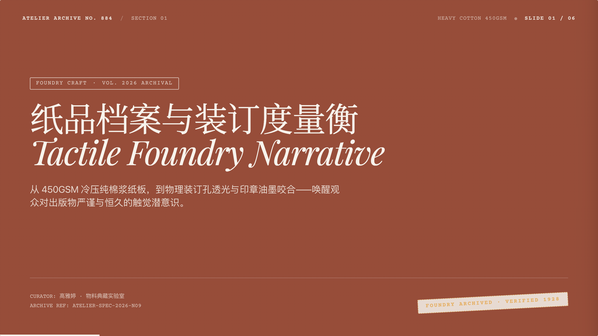
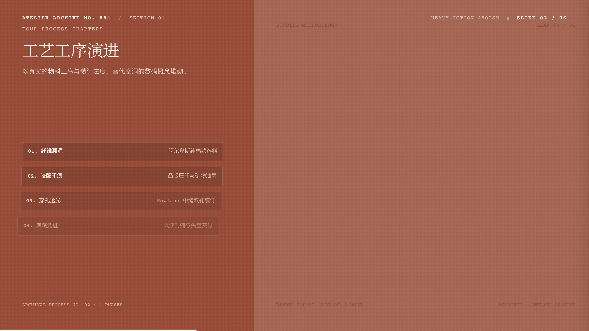
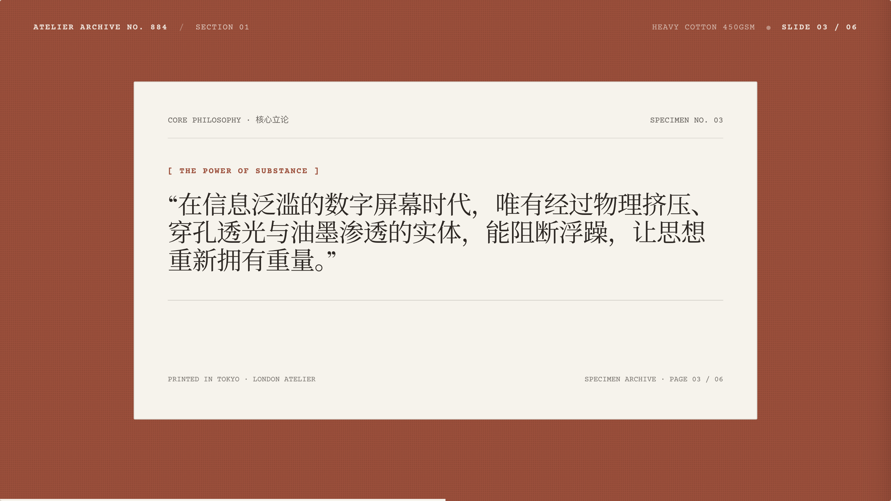
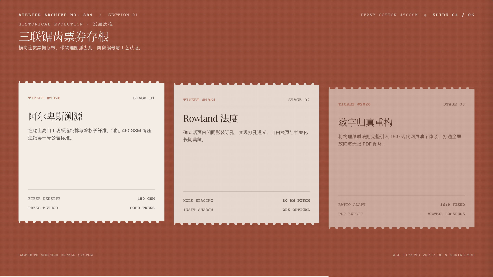
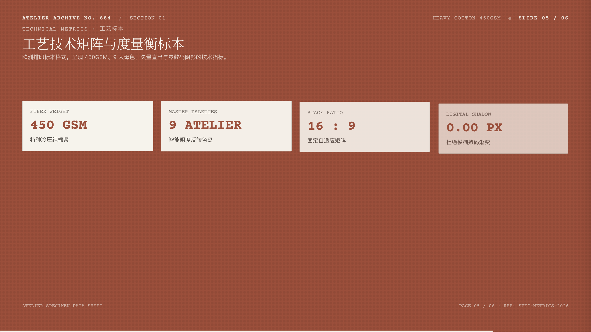
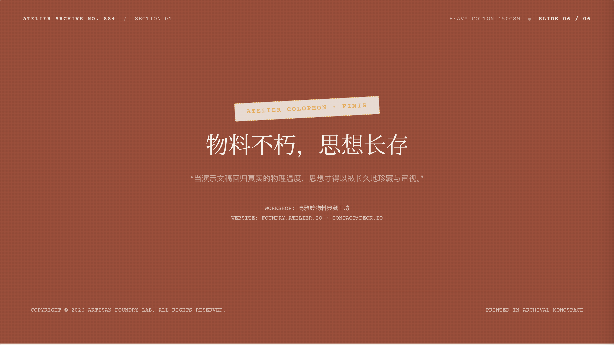
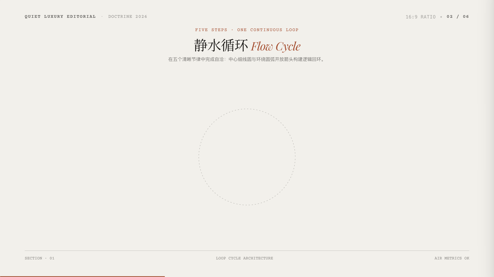
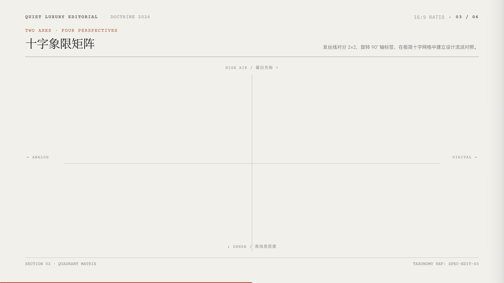
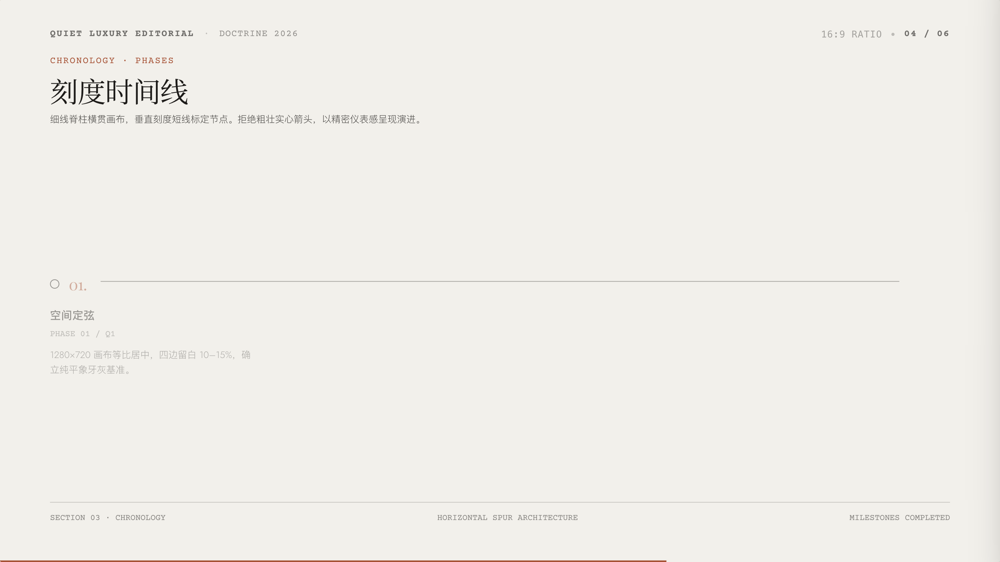

# 双风格专业演示文稿系统规范：权威排版、图示语汇与物料典藏 (Artisan Paper & Minimal Editorial Deck Doctrine)

[](https://docs.anthropic.com/en/docs/agents-and-tools/agent-skills/overview)
[](https://cursor.com)
[](https://deepmind.google/technologies/gemini/)
[](https://gsap.com)
[](LICENSE)

面向 AI 编程助手（Claude Code、Cursor、Antigravity、Copilot、Windsurf 等）的**高品质 16:9 网页级演示文稿、演讲胶片与 Pitch Deck 规范体系**。

彻底剔除传统商业幻灯片中充斥的“大段文字堆砌、塑料数码渐变、高光光晕与无意义彩色色块”，深度融合**世界级权威演示文稿设计理论**，原生支持**两大经典美学体系**，并构建在工业级的 16:9 动态缩放引擎、图形化视觉思考（Visual Thinking）与极简全屏交互闭环之上。

---

## ✨ 核心特色 (Core Highlights)

- 📜 **两大殿堂级美学体系**：
  - **风格 A · Artisan Paper（手工物料与纸质典藏风）**：将真实纸品物料、400GSM 棉浆纤维、活页打孔透光、印刷锯齿撕边票券与欧洲排印标本格式深度融入演示叙事；支持 9 套大师工匠纸色智能高对比反色引擎（深色底自动转为米白墨色）；
  - **风格 B · Minimal Editorial（留白辑要 · 静奢极简编辑风）**：源自高端品牌画册与独立杂志版面，单一暖中性底色、0.5–1px 发丝细线几何、三色上限、四声部排印、大面积呼吸空气感与不对称留白。
- 🎯 **零摩擦单风格自主决断 (Autonomous Selection)**：
  - 单次任务智能体自动研判文案场景并自主决断最契合的一套美学风格直接成卷（杜绝向用户反复确认打扰），成品交付后亦支持随时一键无损重构为另一风格。
- 🏛️ **权威演示理论的工程化落地**：
  - **芭芭拉·明托《金字塔原理》**：结论先行（BLUF）与行动导向标题（Action Titles），杜绝名词短语式主标；
  - **南希·杜阿尔特《Slide:ology》**：3 秒看懂法则（The 3-Second Glance Test），主标断言与视觉焦点一览无余；
  - **加尔·雷诺兹《演说之禅》**：大道至简与留白（間），文字越少力量越强，彻底消灭提词板长篇累牍；
  - **塞斯·高汀极简律**：单页字数硬预算（汉字严格控制在 25–45 字以内，上限 ≤ 60 字）；
  - **罗宾·威廉姆斯 CRAP 基石**：对比（悬殊级差）、重复（发丝线与两角制统一）、对齐（基线对齐）、亲密性（间距即逻辑）；
  - **爱德华·塔夫特**：最大化数据墨水比（Data-Ink Ratio）。
- 📊 **系统化图示设计族谱 (Visual Thinking)**：
  - “文不如表，表不如图”，严禁直排纯文本清单；
  - 内置四大图示族谱：演进与序列（闭环循环飞轮、细密刻度时间线）、结构与层级（同心嵌套圆、侧线支柱导轨）、对比与分布（十字象限散点、拱顶题名色带列表）、证据与断言（大数字陈述、裁切标定画框）。
- 🕹️ **工业级统一 16:9 Deck 交互引擎**：
  - **16:9 固定舞台动态等比缩放**：JS 监听视口并自动以 `Math.min(vw/1280, vh/720)` 变换，无论窗口如何拉伸均永无滚动条、永不撑破；
  - **沉浸全屏模式（按 `F`）**：自动隐退所有边缘 UI，视口背景平滑延展幻灯片底色；
  - **逐层动效与即时重播（按 `R`）**：GSAP 微错落逐层级联入场动效；
  - **全量自动化行内即时编辑（按 `E` & `Cmd+S`）**：底层脚本自动扫描叶子节点，一键进入所见即所得修改模式，修改内容自动持久化至 `localStorage`；
  - **印刷级 16:9 PDF 导出（按 `P` / `Cmd+P`）**：内置矢量打印样式与配套 Puppeteer 无损批量导出脚本。

---

## 🖼 双风格版式缩略图画廊 (Design Gallery)

本系统原生支持两大独立美学体系，以下分别展示两种风格在**封面立论、活页与大纲结构、观点与票券论断、图表与矩阵对比、巨型数字表达、行动结语**等多元排版下的真实 16:9 渲染效果（点击缩略图即可直接在新标签页全屏交互体验）：

### 📜 风格 A · Artisan Paper (手工物料与纸质典藏风)

> **场景定位**：融资路演 Pitch Deck、品牌发布会、年度汇报、工艺/手作/文化宣讲、实体行业汇报。  
> **视觉语汇**：400GSM 棉浆纸张微距纹理、活页双联打孔透光、印刷锯齿撕边票券、多色母版智能反色。  
> 🔗 完整交互范例：[`examples/demo_artisan_paper.html`](examples/demo_artisan_paper.html)

<table width="100%">
  <tr>
    <td width="33.3%" align="center">
      <a href="examples/demo_artisan_paper.html#1"></a>
      <br>
      <b>01 · 封面大版 (Poster Cover)</b><br>
      <sub>档案物料立论封面 · 火漆印章</sub>
    </td>
    <td width="33.3%" align="center">
      <a href="examples/demo_artisan_paper.html#2"></a>
      <br>
      <b>02 · 双联活页议程 (Rowland Split)</b><br>
      <sub>打孔透光装订 · 章节结构导轨</sub>
    </td>
    <td width="33.3%" align="center">
      <a href="examples/demo_artisan_paper.html#3"></a>
      <br>
      <b>03 · 锯齿票券论断 (Sawtooth Ticket)</b><br>
      <sub>撕边物料票券 · 核心金句断言</sub>
    </td>
  </tr>
  <tr>
    <td width="33.3%" align="center">
      <a href="examples/demo_artisan_paper.html#4"></a>
      <br>
      <b>04 · 特性支柱矩阵 (Pillars Grid)</b><br>
      <sub>四列竖向导轨 · 图表特性对比</sub>
    </td>
    <td width="33.3%" align="center">
      <a href="examples/demo_artisan_paper.html#5"></a>
      <br>
      <b>05 · 标本数字度量 (Specimen Metrics)</b><br>
      <sub>巨型数字指标 · 标本清单印证</sub>
    </td>
    <td width="33.3%" align="center">
      <a href="examples/demo_artisan_paper.html#6"></a>
      <br>
      <b>06 · 典藏印章结语 (Archival Outro)</b><br>
      <sub>工坊油墨咬合 · 行动结语落款</sub>
    </td>
  </tr>
</table>

---

### 🏛️ 风格 B · Minimal Editorial (留白辑要 · 静奢极简编辑风)

> **场景定位**：商业策略咨询、极简思考笔记、设计/摄影作品集、前沿科技洞察、文学哲学思考、个人分享。  
> **视觉语汇**：单一暖中性底色（象牙白）、0.5–1px 发丝细线几何、三色上限、四声部排印、大面积呼吸空气感。  
> 🔗 完整交互范例：[`examples/demo_minimal_editorial.html`](examples/demo_minimal_editorial.html)

<table width="100%">
  <tr>
    <td width="33.3%" align="center">
      <a href="examples/demo_minimal_editorial.html#1"></a>
      <br>
      <b>01 · 空镜巨字目录 (Hero-Word & TOC)</b><br>
      <sub>不对称留白 · 衬线编号目录</sub>
    </td>
    <td width="33.3%" align="center">
      <a href="examples/demo_minimal_editorial.html#2"></a>
      <br>
      <b>02 · 闭环循环飞轮 (Loop Flow Cycle)</b><br>
      <sub>因果回路 · 发丝线几何图表</sub>
    </td>
    <td width="33.3%" align="center">
      <a href="examples/demo_minimal_editorial.html#3"></a>
      <br>
      <b>03 · 拱顶色带对比 (Banded Attribute)</b><br>
      <sub>横向色带矩阵 · 高对比度分析</sub>
    </td>
  </tr>
  <tr>
    <td width="33.3%" align="center">
      <a href="examples/demo_minimal_editorial.html#4"></a>
      <br>
      <b>04 · 十字象限散点 (Quadrant Matrix)</b><br>
      <sub>双轴四象限 · 战略坐标定位</sub>
    </td>
    <td width="33.3%" align="center">
      <a href="examples/demo_minimal_editorial.html#5"></a>
      <br>
      <b>05 · 极简数字陈述 (Number Statement)</b><br>
      <sub>大字号纯粹断言 · 最大数据墨水比</sub>
    </td>
    <td width="33.3%" align="center">
      <a href="examples/demo_minimal_editorial.html#6"></a>
      <br>
      <b>06 · 极简行动尾页 (Action Outro)</b><br>
      <sub>克制留白 · 行动呼吁与落款</sub>
    </td>
  </tr>
</table>

---

## ⌨️ 快捷键指南 (Keyboard Shortcuts)

| 按键 | 功能 | 说明 |
| :---: | :---: | :--- |
| `→` / `↓` / `Space` / `Enter` | **下一页** | 切换到下一张幻灯片 |
| `←` / `↑` / `PageUp` | **上一页** | 切换到上一张幻灯片 |
| `Home` / `End` | **首屏 / 末屏** | 快速跳转至第一页或最后一页 |
| **`F`** | **全屏放映** | 隐退导航控件，全屏演讲模式，背景无缝融合 |
| **`R`** | **重播动效** | 重新触发当前页的 GSAP 逐层交错动效 |
| **`E`** | **编辑文案** | 开启行内全量编辑模式，高亮文本虚线框 |
| **`Cmd+S`** / `Ctrl+S` | **保存持久化** | 将编辑后的所有文案自动保存至 LocalStorage |
| **`P`** / `Cmd+P` | **导出 PDF** | 调起浏览器 16:9 无损矢量打印预览 |
| `Esc` | **退出模式** | 退出全屏模式或退出编辑模式 |

---

## 📦 安装与配置 (Installation)

### 方式 1：通过 Skills CLI 安装（推荐）

```bash
npx skills add gaoyatting/artisan-paper-deck
```

### 方式 2：在各类 AI 编程助手中直接配置

将本仓库克隆或放置在您的 Skills 目录下：

```bash
# 克隆到本地
git clone https://github.com/gaoyatting/artisan-paper-deck.git
```

- **Claude Code**：在项目根目录或全局技能配置中包含 `artisan-paper-deck`；
- **Cursor**：将本技能目录软链接或放入 `.cursor/skills/`；
- **Google Antigravity**：放入 `~/.gemini/antigravity/builtin/skills/` 或工作区 skills 目录；
- **Windsurf / GitHub Copilot**：作为上下文或自定义指令载入 `SKILL.md`。

---

## 📁 目录结构 (Directory Structure)

```
artisan-paper-deck/
├── SKILL.md                          # 核心技能规范（双风格哲学、图示语法、交互定律）
├── templates/                        # 开箱即用模板脚手架
│   ├── deck_template.html            # 标准 16:9 多页完整 Deck 脚手架
│   └── editorial_card_scaffold.html  # 静奢单页/卡片快速脚手架
├── examples/                         # 经典版式与完整多页双风格范例
│   ├── demo_artisan_paper.html       # 风格 A：手工纸质物料 6 页完整演示文稿
│   ├── demo_minimal_editorial.html   # 风格 B：留白辑要极简 6 页完整演示文稿
│   ├── 01_intro_deck.html            # 经典 5 页介绍 Deck
│   ├── 02_loop_cycle.html            # 闭环循环飞轮范例
│   ├── 03_nested_circles.html        # 同心嵌套圆范例
│   ├── 04_banded_list.html           # 拱顶题名色带列表范例
│   ├── 05_quadrant_chart.html        # 十字象限散点矩阵范例
│   ├── 06_tick_timeline.html         # 细密刻度时间线范例
│   ├── 07_side_rule_columns.html     # 侧线三列编号支柱范例
│   ├── 08_number_statement.html      # 极简巨型数字陈述范例
│   └── 09_crop_mark_frame.html       # 工业裁切标定画框范例
├── assets/previews/                  # 范例高清缩略图与画廊图片
└── scripts/
    └── export_pdf.js                 # 基于 Puppeteer 的无损 16:9 矢量批量导出脚本
```

---

## 📄 许可证说明 (License & Terms)

本项目遵循 **[CC BY-NC 4.0](LICENSE) (知识共享 署名-非商业性使用 4.0 国际)** 许可协议：

- ✅ **个人与非商业用途 (Free for Non-Commercial)**：
  - 免费且自由用于个人学习、技术研究、内部非营利性演讲分享与衍生修改。
- 💼 **商业营利性用途 (Commercial Authorization Required)**：
  - 若用于商业营利行为（如面向付费客户交付的设计/咨询服务、商业付费培训教材、闭源商业产品集成打包、第三方商业模版转售等），**需事先取得原作者的书面商业许可或商务授权**。
  - 如需商业合作洽谈或获取商用授权，欢迎通过 GitHub Issue 提交沟通。
