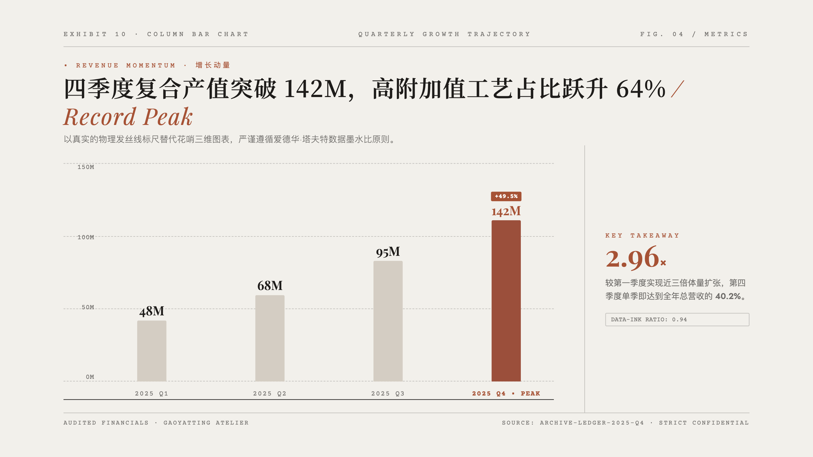
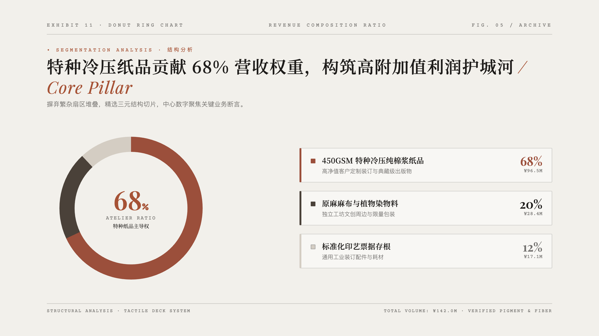
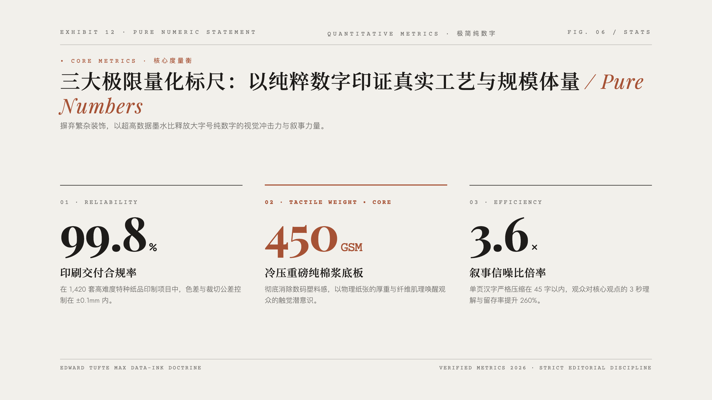
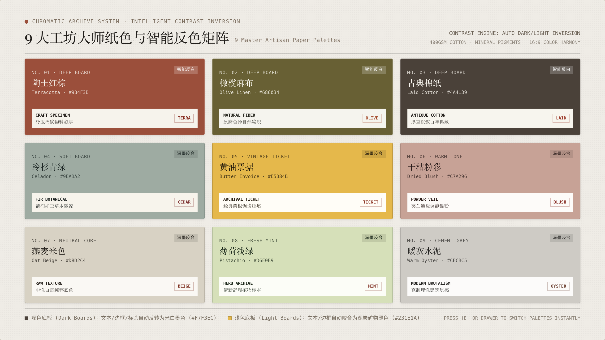
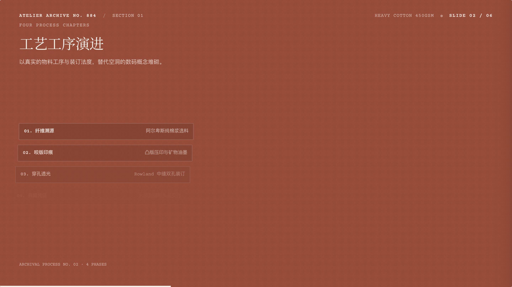
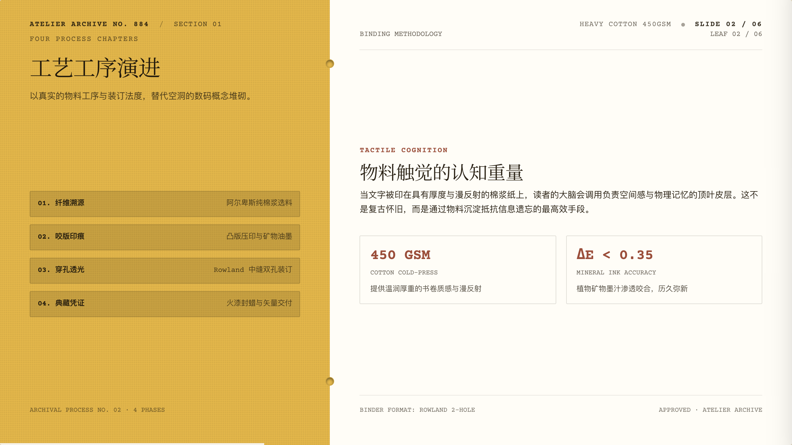
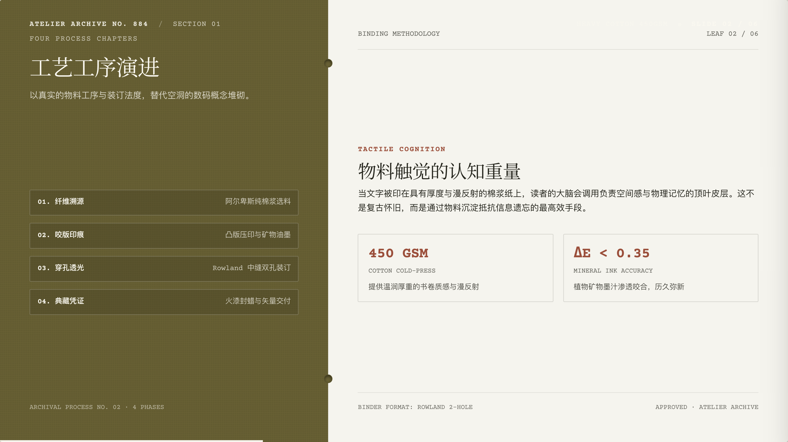
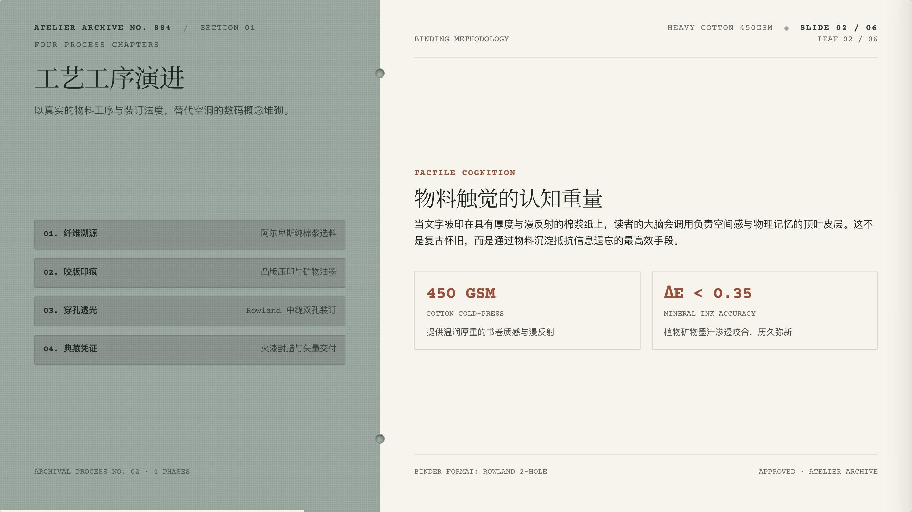

# 双风格专业演示文稿系统规范：权威排版、图示语汇与物料典藏 (Artisan Paper & Minimal Editorial Deck Doctrine)

[](https://docs.anthropic.com/en/docs/agents-and-tools/agent-skills/overview)
[](https://cursor.com)
[](https://deepmind.google/technologies/gemini/)
[](https://gsap.com)
[](LICENSE)

面向 AI 编程助手（Claude Code、Cursor、Antigravity、Copilot、Windsurf 等）的**高品质 16:9 网页级演示文稿、演讲胶片与 Pitch Deck 规范体系**。

彻底剔除传统商业幻灯片中充斥的“大段文字堆砌、塑料数码渐变、高光光晕与无意义彩色色块”，深度融合**世界级权威演示文稿设计理论**，原生支持**两大经典美学体系**，并构建在工业级的 16:9 动态缩放引擎、图形化视觉思考（Visual Thinking）与极简全屏交互闭环之上。

---

## ✨ 核心特色 (Core Highlights)

- 📜 **两大殿堂级美学体系**：
  - **风格 A · Artisan Paper（手工物料与纸质典藏风）**：将真实纸品物料、400GSM 棉浆纤维、活页打孔透光、印刷锯齿撕边票券与欧洲排印标本格式深度融入演示叙事；支持 9 套大师工匠纸色智能高对比反色引擎（深色底自动转为米白墨色）；
  - **风格 B · Minimal Editorial（留白辑要 · 静奢极简编辑风）**：源自高端品牌画册与独立杂志版面，单一暖中性底色、0.5–1px 发丝细线几何、三色上限、四声部排印、大面积呼吸空气感与不对称留白。
- 🎯 **杜绝模版套用 · 形式追随内容 (Form Follows Content)**：
  - **绝不让用户在几套死板模版中做单选题！** 智能体根据用户输入的文案属性、受众与数据关系，**现场自由推导构图与图示组合**。文案变则排版变，图表、纯数字、票据、支柱自如衍生。
- 🏛️ **权威演示理论的工程化落地**：
  - **芭芭拉·明托《金字塔原理》**：结论先行（BLUF）与行动导向标题（Action Titles），杜绝名词短语式主标；
  - **南希·杜阿尔特《Slide:ology》**：3 秒看懂法则（The 3-Second Glance Test），主标断言与视觉焦点一览无余；
  - **加尔·雷诺兹《演说之禅》**：大道至简与留白（間），文字越少力量越强，彻底消灭提词板长篇累牍；
  - **塞斯·高汀极简律**：单页字数硬预算（汉字严格控制在 25–45 字以内，上限 ≤ 60 字）；
  - **罗宾·威廉姆斯 CRAP 基石**：对比（悬殊级差）、重复（发丝线与两角制统一）、对齐（基线对齐）、亲密性（间距即逻辑）；
  - **爱德华·塔夫特**：最大化数据墨水比（Data-Ink Ratio）。
- 📊 **系统化图示设计族谱 (Visual Thinking)**：
  - “文不如表，表不如图”，严禁直排纯文本清单；
  - 支持柱形对比图、结构比例圆环图、因果增强飞轮、刻度时间线、十字象限、纯数字看板、拱顶色带、标本画框等多维图形语汇。
- 🕹️ **工业级统一 16:9 Deck 交互引擎**：
  - **16:9 固定舞台动态等比缩放**：JS 监听视口并自动以 `Math.min(vw/1280, vh/720)` 变换，无论窗口如何拉伸均永无滚动条、永不撑破；
  - **沉浸全屏模式（按 `F`）**：自动隐退所有边缘 UI，视口背景平滑延展幻灯片底色；
  - **逐层动效与即时重播（按 `R`）**：GSAP 微错落逐层级联入场动效；
  - **全量自动化行内即时编辑（按 `E` & `Cmd+S`）**：底层脚本自动扫描叶子节点，一键进入所见即所得修改模式，修改内容自动持久化至 `localStorage`；
  - **印刷级 16:9 PDF 导出（按 `P` / `Cmd+P`）**：内置矢量打印样式与配套 Puppeteer 无损批量导出脚本。

---

## 🌟 视觉可能与版式表现力集锦 (Endless Layout Possibilities)

> [!TIP]
> **形式严格追随内容 · 拒绝公式化固定套路**  
> 本系统**不设任何死板的固化模板**。每一页幻灯片皆由 AI 智能体根据您的具体文案语义、逻辑脉络与数据关系**现场推导、有机设计**。  
> 以下集中展示本系统在**数据图表、纯数字度量、物料排版与极简编辑**等不同场景下的代表性视觉表现力与灵感思路（点击任意预览即可在新标签页体验交互原型源码）：

### 1. 📊 权威数据图表与图形思考 (Data Charts & Visual Thinking)

杜绝三维立体与廉价数码渐变，遵循塔夫特数据墨水比，以纯粹矢量发丝几何构建高信噪比图表：

<table width="100%">
  <tr>
    <td width="50%" align="center">
      <a href="examples/10_column_bar_chart.html"></a>
      <br>
      <b><a href="examples/10_column_bar_chart.html">柱形对比图 (Column Bar Chart)</a></b><br>
      <sub>发丝刻度基线 · 季度增量高亮 · 侧栏关键结论卡片</sub>
    </td>
    <td width="50%" align="center">
      <a href="examples/11_donut_ring_chart.html"></a>
      <br>
      <b><a href="examples/11_donut_ring_chart.html">结构圆环图 (Donut Ring Chart)</a></b><br>
      <sub>精密 SVG 环状切片 · 中心大字号核心指标 · 结构明细条目卡</sub>
    </td>
  </tr>
  <tr>
    <td width="50%" align="center">
      <a href="examples/02_loop_cycle.html"></a>
      <br>
      <b><a href="examples/02_loop_cycle.html">闭环增强回路飞轮 (Loop Cycle Flywheel)</a></b><br>
      <sub>四阶段因果自驱动回路 · 细线导轨弧线 · 中心徽标锚点</sub>
    </td>
    <td width="50%" align="center">
      <a href="examples/05_quadrant_chart.html"></a>
      <br>
      <b><a href="examples/05_quadrant_chart.html">战略十字象限矩阵 (2×2 Quadrant Axis)</a></b><br>
      <sub>双轴四象限战略坐标 · 散点分布标定 · 差异化价值区位</sub>
    </td>
  </tr>
</table>

---

### 2. 🔢 纯数字度量衡与高墨水比断言 (Pure Numbers & Quantitative Impact)

当文稿的核心在于关键数据突破时，以超大字号数字压阵，赋予画面极具力量感的留白与冲击力：

<table width="100%">
  <tr>
    <td width="50%" align="center">
      <a href="examples/12_pure_number_stats.html"></a>
      <br>
      <b><a href="examples/12_pure_number_stats.html">纯数字陈述大版 (Pure Numbers Showcase)</a></b><br>
      <sub>84px 衬线巨字 · 核心度量衡三列阵列 · 极致信噪比释放</sub>
    </td>
    <td width="50%" align="center">
      <a href="examples/demo_artisan_paper.html#5"></a>
      <br>
      <b><a href="examples/demo_artisan_paper.html#5">标本技术矩阵 (Specimen Data Sheet)</a></b><br>
      <sub>欧洲排印标本格式 · 4 栏度量指标 · 等宽技术参数校验表</sub>
    </td>
  </tr>
</table>

---

### 3. 📜 纸质物料典藏与触觉排版 (Artisan Paper Material Layouts)

将 400GSM 棉浆纤维微距底纹、物理打孔透光、锯齿撕边票券与火漆印章融入实体商业与路演叙事：

<table width="100%">
  <tr>
    <td width="33.3%" align="center">
      <a href="examples/demo_artisan_paper.html#1"></a>
      <br>
      <b>立论大字封面 (Poster Cover)</b><br>
      <sub>火漆印章 · 档案打字机元信息</sub>
    </td>
    <td width="33.3%" align="center">
      <a href="examples/demo_artisan_paper.html#2"></a>
      <br>
      <b>双联活页大纲 (Rowland Split)</b><br>
      <sub>打孔透光内阴影 · 双栏结构导轨</sub>
    </td>
    <td width="33.3%" align="center">
      <a href="examples/demo_artisan_paper.html#3"></a>
      <br>
      <b>锯齿撕边票券 (Sawtooth Ticket)</b><br>
      <sub>物理圆弧齿孔 · 悬浮金句卡片</sub>
    </td>
  </tr>
</table>

---

### 4. 🏛️ 静奢编辑与四声部排印 (Quiet Luxury Minimal Editorial)

象牙暖白底色、0.5–1px 发丝细线几何、不对称留白、三色上限，如独立杂志画册般沉静：

<table width="100%">
  <tr>
    <td width="33.3%" align="center">
      <a href="examples/demo_minimal_editorial.html#1"></a>
      <br>
      <b>空镜巨字与目录 (Hero-Word & TOC)</b><br>
      <sub>不对称留白 · 老式衬线编号目录</sub>
    </td>
    <td width="33.3%" align="center">
      <a href="examples/04_banded_list.html"></a>
      <br>
      <b>拱顶色带对比 (Banded Attribute)</b><br>
      <sub>拱顶题名 · 高对比三色带对照列表</sub>
    </td>
    <td width="33.3%" align="center">
      <a href="examples/demo_minimal_editorial.html#6"></a>
      <br>
      <b>极简行动尾页 (Action Outro)</b><br>
      <sub>发丝细线边框 · 克制行动呼吁落款</sub>
    </td>
  </tr>
</table>

---

## 🎨 9 大工坊大师纸色与智能反色系统 (Master Paper Palettes)

系统内置 9 种源自欧洲独立手工工坊与典藏档案的经典纸品母色。针对不同明度的纸板底色，系统搭载了**智能高对比反色引擎（Intelligent Contrast Inversion）**：深色纸板（陶土红棕、橄榄麻布、古典棉纸）自动反转为米白墨色；浅色票据纸板自动咬合为深炭矿物油墨，确保在任何投影与屏幕上均具备绝对权威的可读性。



### 🔄 同一版式多母色自适应对比 (Adaptive Palette Switching)

通过调用配置抽屉或按键，同一套幻灯片可零损耗瞬时换肤，所有卡片背景、墨水对比度与印章色阶自动重算：

<table width="100%">
  <tr>
    <td width="25%" align="center">
      
      <br>
      <b>01 · 陶土红棕 (Terracotta)</b><br>
      <sub>深色底板 · 象牙墨自动反白</sub>
    </td>
    <td width="25%" align="center">
      
      <br>
      <b>05 · 黄油票据 (Butter Invoice)</b><br>
      <sub>经典票根 · 暖黄深炭矿物墨</sub>
    </td>
    <td width="25%" align="center">
      
      <br>
      <b>02 · 橄榄麻布 (Olive Linen)</b><br>
      <sub>原麻深底 · 自然雅致古朴墨</sub>
    </td>
    <td width="25%" align="center">
      
      <br>
      <b>04 · 冷杉青绿 (Celadon)</b><br>
      <sub>清润青灰 · 深黛绿植物咬合</sub>
    </td>
  </tr>
</table>

---

## ⌨️ 快捷键指南 (Keyboard Shortcuts)

| 按键 | 功能 | 说明 |
| :---: | :---: | :--- |
| `→` / `↓` / `Space` / `Enter` | **下一页** | 切换到下一张幻灯片 |
| `←` / `↑` / `PageUp` | **上一页** | 切换到上一张幻灯片 |
| `Home` / `End` | **首屏 / 末屏** | 快速跳转至第一页或最后一页 |
| **`F`** | **全屏放映** | 隐退导航控件，全屏演讲模式，背景无缝融合 |
| **`R`** | **重播动效** | 重新触发当前页的 GSAP 逐层交错动效 |
| **`E`** | **编辑文案** | 开启行内全量编辑模式，高亮文本虚线框 |
| **`Cmd+S`** / `Ctrl+S` | **保存持久化** | 将编辑后的所有文案自动保存至 LocalStorage |
| **`P`** / `Cmd+P` | **导出 PDF** | 调起浏览器 16:9 无损矢量打印预览 |
| `Esc` | **退出模式** | 退出全屏模式或退出编辑模式 |

---

## 📦 安装与配置 (Installation)

### 方式 1：通过 Skills CLI 安装（推荐）

```bash
npx skills add gaoyatting/artisan-paper-deck
```

### 方式 2：在各类 AI 编程助手中直接配置

将本仓库克隆或放置在您的 Skills 目录下：

```bash
# 克隆到本地
git clone https://github.com/gaoyatting/artisan-paper-deck.git
```

- **Claude Code**：在项目根目录或全局技能配置中包含 `artisan-paper-deck`；
- **Cursor**：将本技能目录软链接或放入 `.cursor/skills/`；
- **Google Antigravity**：放入 `~/.gemini/antigravity/builtin/skills/` 或工作区 skills 目录；
- **Windsurf / GitHub Copilot**：作为上下文或自定义指令载入 `SKILL.md`。

---

## 📁 目录结构 (Directory Structure)

```
artisan-paper-deck/
├── SKILL.md                          # 核心规范与思维引擎（排版哲学、图示族谱、交互定律）
├── templates/                        # 开箱即用底座脚手架（自适应 16:9 舞台与交互脚本）
│   ├── deck_template.html            # 标准 16:9 多页交互 Deck 基础容器
│   └── editorial_card_scaffold.html  # 单页极简卡片轻量脚手架
├── examples/                         # 排版灵感与设计思考参考（图表/纯数字/物料/极简思路原型，拒绝模板套用）
│   ├── 10_column_bar_chart.html      # 柱形对比图表原型
│   ├── 11_donut_ring_chart.html      # 结构比例圆环图原型
│   ├── 12_pure_number_stats.html     # 纯数字度量衡大版原型
│   ├── demo_artisan_paper.html       # 风格 A 手工纸质物料完整多页参考
│   ├── demo_minimal_editorial.html   # 风格 B 静奢极简完整多页参考
│   └── ...                           # 闭环飞轮、时间线、象限等其他思路原型
├── assets/previews/                  # 高清缩略图、图表与色卡矩阵图片
└── scripts/
    └── export_pdf.js                 # 基于 Puppeteer 的无损 16:9 矢量批量导出脚本
```

---

## 📄 许可证说明 (License & Terms)

本项目遵循 **[CC BY-NC 4.0](LICENSE) (知识共享 署名-非商业性使用 4.0 国际)** 许可协议：

- ✅ **个人与非商业用途 (Free for Non-Commercial)**：
  - 免费且自由用于个人学习、技术研究、内部非营利性演讲分享与衍生修改。
- 💼 **商业营利性用途 (Commercial Authorization Required)**：
  - 若用于商业营利行为（如面向付费客户交付的设计/咨询服务、商业付费培训教材、闭源商业产品集成打包、第三方商业模版转售等），**需事先取得原作者的书面商业许可或商务授权**。
  - 如需商业合作洽谈或获取商用授权，欢迎通过 GitHub Issue 提交沟通。
